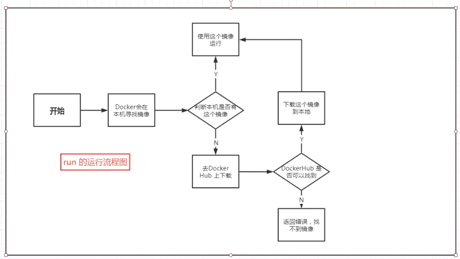

## docker 配置阿里云镜像加速
> [!TIP|label:步骤]
> 1. 打开 [阿里云](https://cr.console.aliyun.com/cn-hangzhou/instances/mirrors) （控制台 → 左上角菜单 → 产品与服务 → 弹性计算 → 容器镜像服务 → 镜像加速器）
> 其中涉及到 设置密码等操作 这里就不再赘述    
> 
> 2. 按照下图所示步骤即可完成 阿里云镜像加速
> 
> 

> [!WARNING|label:注意]
> 配置阿里云镜像加速时要看自己的操作系统是啥，我是在树莓派上部署的用的是乌班图，如果在阿里云主机上用centos系统 就按照centos系统的指示来

## docker run的原理和流程
> [!TIP|label:如图所示]
> 
